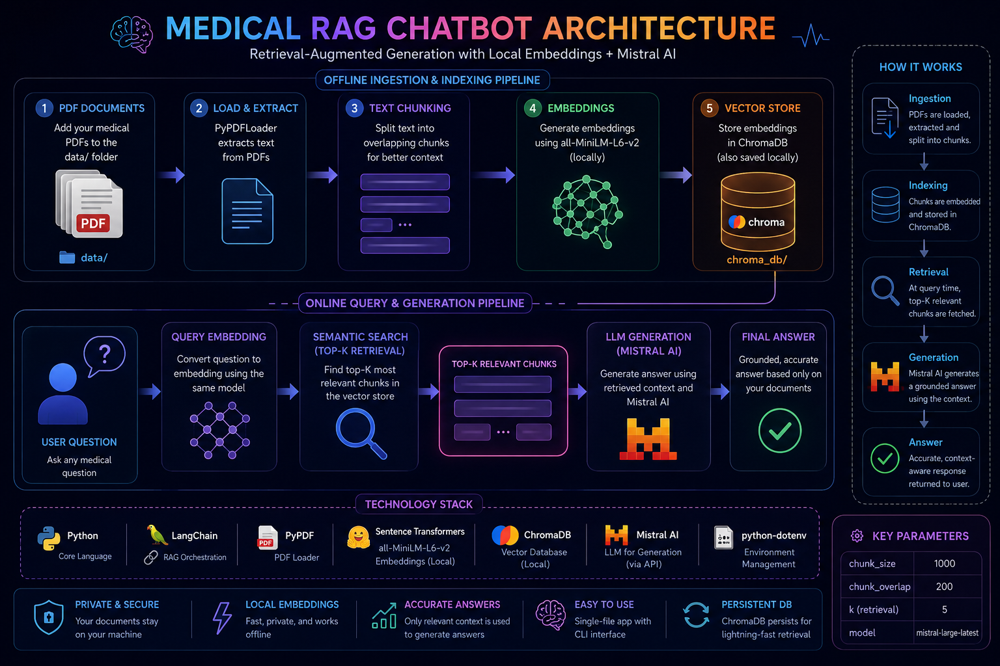

# 🧠 Medical RAG Chatbot



> An ultra-lightweight, single-file Retrieval-Augmented Generation (RAG) chatbot that answers questions grounded in your own medical PDF documents — powered by local embeddings and Mistral AI.

---

## ✨ Features

- 📄 **PDF Ingestion** — Automatically loads and parses all PDFs from your `data/` folder
- ✂️ **Smart Text Chunking** — Splits documents into semantically meaningful chunks
- 🔍 **Local Embeddings** — Uses `all-MiniLM-L6-v2` via `sentence-transformers` (runs offline)
- 🗄️ **ChromaDB Vector Store** — Persists embeddings locally for fast semantic retrieval
- 🤖 **Mistral AI Generation** — Produces accurate, context-aware answers via `ChatMistralAI`
- 💬 **CLI Chat Interface** — Clean, interactive terminal experience, zero frontend required
- 🗂️ **Single-File Architecture** — The entire pipeline lives in one `app.py`

---

## 🏗️ Project Structure

```text
Med_Bot/
│
├── data/           # 📥 Place your medical PDF files here
├── chroma_db/      # 🗄️ Auto-generated local vector database
│
├── app.py          # 🧠 THE ONLY FILE — ingestion, pipeline & chat
├── .env            # 🔑 Your Mistral API key (not committed to git)
└── README.md       # 📖 You are here
```

> **Note:** `chroma_db/` is created automatically on first run. You never need to touch it.

---

## ⚙️ Installation & Setup

### 1. Create your project folder

```bash
mkdir Med_Bot
cd Med_Bot
```

### 2. Create and activate a virtual environment

```bash
# macOS / Linux
python3 -m venv venv
source venv/bin/activate

# Windows
python -m venv venv
venv\Scripts\activate
```

### 3. Install all dependencies

```bash
pip install langchain langchain-community langchain-huggingface langchain-mistralai pypdf chromadb sentence-transformers python-dotenv
```

### 4. Configure your API key

Create a `.env` file in the project root:

```env
MISTRAL_API_KEY=your_actual_api_key_here
```

> **Tip:** Get your free Mistral API key at [console.mistral.ai](https://console.mistral.ai)

Alternatively, export it in your terminal:

```bash
# macOS / Linux
export MISTRAL_API_KEY="your_key_here"

# Windows
set MISTRAL_API_KEY="your_key_here"
```

---

## 🚀 Usage

### Step 1 — Add your PDFs

Drop any medical reference PDFs (textbooks, guidelines, research papers, etc.) into the `data/` folder:

```
Med_Bot/
└── data/
    ├── harrison_principles.pdf
    ├── drug_reference_2024.pdf
    └── clinical_guidelines.pdf
```

### Step 2 — Launch the app

```bash
python app.py
```

On **first run**, the script will automatically:
1. Detect and load all PDFs from `data/`
2. Split the text into chunks
3. Generate embeddings locally
4. Build and save the ChromaDB vector database
5. Drop you straight into the chat interface

On **subsequent runs**, it skips ingestion and loads the existing database instantly.

### Step 3 — Ask questions

```
=== 🧠 Medical RAG Chatbot System ===
[!] No existing vector database found. Starting fresh ingestion...
📥 Step 1: Loading PDF documents...
✂️ Step 2: Splitting text into chunks...
🧠 Step 3: Generating embeddings and saving to ChromaDB...
✅ Vector database successfully built and saved locally!
⚙️ Configuring RAG pipeline with Mistral AI...

🤖 Bot is ready! Ask your medical questions below.
👉 Type 'exit' or 'quit' to close the program.
========================================

👤 Ask: What is the first-line treatment for hypertension?
⏳ Thinking...

🤖 Answer: Based on the provided documents, first-line treatment for hypertension includes...

👤 Ask: exit
👋 Goodbye!
```

---

## 🧩 How It Works

```
Your PDFs  →  Text Chunks  →  Embeddings (MiniLM)  →  ChromaDB
                                                           │
User Question  →  Query Embedding  →  Semantic Search ────┘
                                           │
                               Top-K Relevant Chunks
                                           │
                               Mistral AI (LLM) + Context
                                           │
                                    Final Answer ✅
```

1. **Ingestion** — PDFs are loaded with `PyPDFLoader`, split into overlapping chunks
2. **Indexing** — Each chunk is embedded with `all-MiniLM-L6-v2` and stored in ChromaDB
3. **Retrieval** — At query time, the top-K most semantically similar chunks are fetched
4. **Generation** — Mistral AI synthesizes a grounded answer using only the retrieved context

---

## 📦 Dependencies

| Package | Purpose |
|---|---|
| `langchain` | Core RAG orchestration framework |
| `langchain-community` | PDF loaders, vector store integrations |
| `langchain-huggingface` | HuggingFace embeddings wrapper |
| `langchain-mistralai` | Mistral AI LLM integration |
| `pypdf` | PDF text extraction |
| `chromadb` | Local vector database |
| `sentence-transformers` | `all-MiniLM-L6-v2` embedding model |
| `python-dotenv` | Load API key from `.env` file |

---

## 🔧 Configuration

Key parameters you can tune inside `app.py`:

| Parameter | Default | Description |
|---|---|---|
| `chunk_size` | `1000` | Characters per text chunk |
| `chunk_overlap` | `200` | Overlap between chunks to preserve context |
| `k` (retrieval) | `5` | Number of chunks retrieved per query |
| `model` | `mistral-large-latest` | Mistral model to use for generation |

---

## 🛡️ Important Notes

- **This tool is for educational and research purposes only.** It is not a substitute for professional medical advice, diagnosis, or treatment.
- Answer quality depends entirely on the quality and coverage of the PDFs you provide.
- The embedding model runs locally — your documents never leave your machine. Only your questions and retrieved context are sent to Mistral AI's API.

---

## 🤝 Contributing

Contributions are welcome! Feel free to open an issue or submit a pull request for improvements such as:
- Web UI (Streamlit / Gradio)
- Multi-modal support (images, tables)
- Support for additional LLM providers
- Re-ingestion commands for updating the database

---

## 📄 License

This project is open-source and available under the [MIT License](LICENSE).
